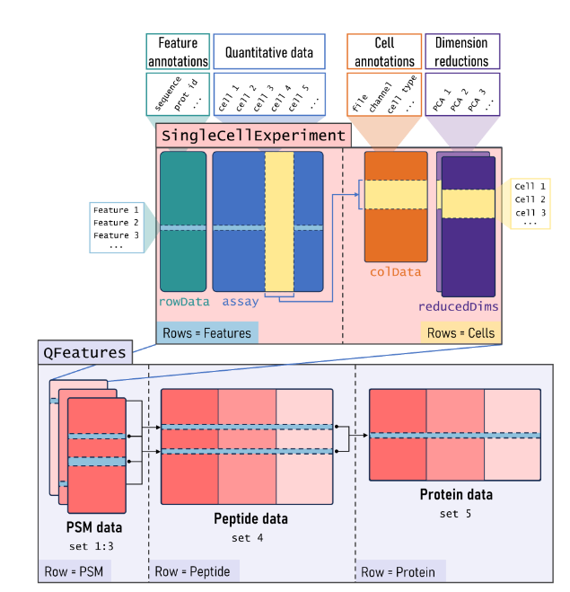

```{r setup, include=FALSE}
knitr::opts_chunk$set(echo = TRUE)
```

```{r packages}
library(tidyverse)
library(plotly)
library(DT)
library(modelsummary)
```

# Multi dimension size benchmark



Size report on generated datasets. Each generated dataset is a combination of 4 variables that impact the object size, the variable are the following.

-   nFeat = Number of features by cell (PSM identification depth)
-   nCell = Number of cells by assay (batch) =\> 1, 16 or 32
-   nAssay = Number of assay (batch) in the QFeatures object
-   nCol = Number of columns in the rowData DataFrame (data associated with each PSM)

The goal is to understand what is the most impactful variable in term of object size. We also want to know if the number of cells by assay (ie. Label-Free vs Labelled) impact the size for a constant number of total cells.

```{r loadData}
convert_bytes_to_mib <- function(bytes) {
  mib <- bytes / (2^20)
  return(mib)
}

sizeTable <- read.table("dataOutput/4_variables_benchmark/qfeatures_size_report.tsv", header = TRUE)

sizeCols <- grep("size", colnames(sizeTable))
for (sizeCol in sizeCols) {
    sizeTable[[paste0(colnames(sizeTable)[[sizeCol]], "_MiB")]] <- convert_bytes_to_mib(sizeTable[[sizeCol]])
}
sizeTable$totalCells <- sizeTable$nCell * sizeTable$nAssay
DT::datatable(sizeTable,
                extensions = "FixedColumns",
                options = list(
                    searching = FALSE,
                    scrollX = TRUE,
                    fixedColumns = TRUE,
                    pageLength = 10,
                    lengthMenu = c(10, 25, 50)
                ))
```

## Comparing different number of cells by assay

```{r compareLFTMT}
# For the same number of cells: 

sizeLFTMT <- sizeTable %>%
    filter(nFeat == 4000,
           nCol == 100,
           totalCells == 256) %>%
    mutate(totalCells = as.factor(totalCells),
           nCell = as.factor(nCell))
ggplotly(ggplot(sizeLFTMT, aes(x = nCell, y = sizeTotal_MiB, fill = nCell)) +
           geom_col())
```

We can see that the number of cells by assay impact linearly the object size for a constant number of total cells. This is mostly due to the fact that LF (1 cell by assay) data has to store one rowData for each cells. On the other hand labelled data (16 or 32) can have a single rowData for 16/32 cells. This parameter impact significantly the object size but we can't optimize it, there is just more data. One possibility would be to lower the number of variables present in the rowData (filter out irrelevant variables). Note that here we compare the size for a fixed number of cells, but in reality most of the time labelled data hold more cells, and the highest sample throughput is achieved by labelled techniques. But we cannot predict the future, maybe LF data will make a breakthrough since the MS-instrument used in this case don't need to compute MS2 or MS3.

For instance a LF free dataset composed of 432 cells takes 2.5Gb in memory (brunner2022) while a TMT-18 dataset composed of 2400 cells takes 1.9Gb in memory (leduc2022)

```{r}
propTable <- sizeTable %>% 
    filter(nCol == 50,
           nFeat == 4000) %>%
    filter(totalCells == 256) %>%
    pivot_longer(cols = 10:12, names_to = "component", values_to = "size")

propTable1 <- filter(propTable, nCell == 1)

propTable16 <- filter(propTable, nCell == 16)

propTable32 <- filter(propTable, nCell == 32)

size1 <- propTable1[1, "sizeTotal_MiB"]
size16 <- propTable16[1, "sizeTotal_MiB"]
size32 <- propTable32[1, "sizeTotal_MiB"]
```

The following pie charts show the importance of the rowData on the global size of the object for different number of cells by assay. 

```{r}
fig1 <- plot_ly(propTable1, labels = ~component, values = ~size, type = 'pie')

fig1 <- fig1 %>% layout(title = paste0('nCell = 1 - Total size = ', size1, " MiB"),

         xaxis = list(showgrid = FALSE, zeroline = FALSE, showticklabels = FALSE),

         yaxis = list(showgrid = FALSE, zeroline = FALSE, showticklabels = FALSE))
fig1
```

```{r}
fig16 <- plot_ly(propTable16, labels = ~component, values = ~size, type = 'pie')

fig16 <- fig16 %>% layout(title = paste0('nCell = 16 - Total size = ', size16, " MiB"),

         xaxis = list(showgrid = FALSE, zeroline = FALSE, showticklabels = FALSE),

         yaxis = list(showgrid = FALSE, zeroline = FALSE, showticklabels = FALSE))
fig16
```

```{r}
fig32 <- plot_ly(propTable32, labels = ~component, values = ~size, type = 'pie')

fig32 <- fig32 %>% layout(title = paste0('nCell = 32 - Total size = ', size32, " MiB"),

         xaxis = list(showgrid = FALSE, zeroline = FALSE, showticklabels = FALSE),

         yaxis = list(showgrid = FALSE, zeroline = FALSE, showticklabels = FALSE))
fig32
```

## Trying to see the impact of each variable

I think is quite difficult to visualize the impact of all variables. There are maybe better ways.

```{r}
plot3Ddata <- sizeTable %>% 
  filter(nCol == 50)
plot_ly(x=plot3Ddata$nCell, y=plot3Ddata$nAssay, z=plot3Ddata$nFeat, type="scatter3d", mode="markers", color=plot3Ddata$sizeTotal_MiB)
```

I don't think it really make sense to run a regression on the data. 
```{r}
mod <- lm(data = sizeTable, formula = sizeTotal_MiB ~ nCell + nAssay + nFeat + nCol)

modelplot(mod, coef_omit = "Intercept", color = "blue", size = 1) +
  labs(title="Raw coefficients for mod")
```

```{r}
# impact of nCell
nCellTable <- sizeTable %>% 
    filter(nCol == 50,
           nFeat == 2000,
           nAssay == 128)

ggplotly(ggplot(nCellTable, aes(x = nCell, y = sizeTotal_MiB)) + 
             geom_point() + 
             geom_line(alpha = 0.6) +
             xlim(0, 32) +
             ylim(0, 700))
summary(lm(nCellTable, formula = sizeTotal_MiB ~ nCell))
```
Here we can see that the number of cells by assay does not really impact the global, even if the total number of cells increase (due to the increase data size of rowData)
```{r}
# impact of nAssay
nAssayTable <- sizeTable %>% 
    filter(nCol == 50,
           nFeat == 2000,
           nCell == 16)

ggplotly(ggplot(nAssayTable, aes(x = nAssay, y = sizeTotal_MiB)) + 
             geom_point() + 
             geom_line(alpha = 0.6) +
             xlim(0, 130) +
             ylim(0, 700))

summary(lm(nAssayTable, formula = sizeTotal_MiB ~ nAssay))

```
The number of assay impact strictly linearly the global size. This logic since an assay is the smaller building part of a QFeatures. If we go from 4 assays to 8 we will increase by a factor 2 the global size.
```{r}
# impact of nFeat
nFeatTable <- sizeTable %>% 
    filter(nCol == 50,
           nAssay == 128,
           nCell == 16)

ggplotly(ggplot(nFeatTable, aes(x = nFeat, y = sizeTotal_MiB)) + 
             geom_point() + 
             geom_line(alpha = 0.6) +
             xlim(0, 4000) +
             ylim(0, 700))

summary(lm(nFeatTable, formula = sizeTotal_MiB ~ nFeat))
```
The number of features impact linearly (tough not 1 to 1). This is mostly due to the fact the the number of features impact the rowData size (and the matrix size, but this is not the component that impact the global size)

```{r}
# impact of nCol
nColTable <- sizeTable %>% 
    filter(nFeat == 2000,
           nAssay == 128,
           nCell == 16)

ggplotly(ggplot(nColTable, aes(x = nCol, y = sizeTotal_MiB)) + 
             geom_point() +
             geom_line(alpha = 0.6) +
             xlim(0, 100) +
             ylim(0, 700))

summary(lm(nColTable, formula = sizeTotal_MiB ~ nCol))

```
The number of features impact linearly (tough not 1 to 1). This show that the rowData size is really an import part of the global size. We can also see that if we simply filter out irrelevant columns for the analysis we can lower significantly the global size (we usually don't use more than 10 variable from the rowData during an analysis) 


# Single step benchmark

```{r dataLoadingSingle}
inputDir <- "dataOutput/individualStepsBenchmark"
files <- list.files(path = inputDir, full.names = TRUE)
fileSizeReport <- "dataOutput/individualStepsBenchmark/qfeatures_size_report.tsv"
stepResults <- files[!files == fileSizeReport]

stepDataList <- lapply(stepResults, function(x) {
    l <- as.list(read.csv(x)[1, 3:5])
    l$name <- sub(".csv", "", basename(x))
    l
})

sizeTable <- read.table(fileSizeReport, header = TRUE)

peakRamTable <- do.call(rbind, lapply(stepDataList, as.data.frame))
peakRamTable <- separate(peakRamTable, name, into = c("nCell", "step", "replicate"), sep = "_")

DT::datatable(peakRamTable)
```
## Elapsed time by step

```{r heatmapTime}
nCell_order <- c("500", "1000", "2000", "4000")
step_order <- c(
    "benchmarkFilterFeatures",
    "benchmarkFilterSamples",
    "benchmarkZeroisNA",
    "benchmarkAggPSM",
    "benchmarkJoinPSM",
    "benchmarkNormSampPep",
    "benchmarkNormFeatPep",
    "benchmarkLogPep",
    "benchmarkAggPep",
    "benchmarkImputePro")

timeMedian <- peakRamTable %>% 
    group_by(nCell, step) %>% 
    summarise(medianTimeElasped = median(Elapsed_Time_sec)) %>% 
    ungroup() %>% 
    mutate(nCell = factor(nCell, levels = nCell_order),
           step = factor(step, levels = rev(step_order)))

ggplotly(ggplot(timeMedian, aes(nCell, step, fill = medianTimeElasped)) + 
    geom_tile())

# scaled log2
ggplotly(ggplot(timeMedian, aes(nCell, step, fill = medianTimeElasped)) + 
    geom_tile() +
        scale_fill_gradient2(low = "blue", mid = "white", high = "red",
                                midpoint = median(peakRamTable$Elapsed_Time_sec, na.rm = TRUE),
                                transform = "log2"))
```

- Filter samples seems to have a non linear time complexity which was not expected
  - Maybe due to the use of a global colData?
  - Really need to profile the code and study its theoretical complexity
  - If it is due to the global colData this would mean that the integration of a global rowData could impact the runtime of some steps (! implementation)
- As expected the important bottleneck in term of time is the aggregation step (from PSM to peptides)
  - It is expected since it is the step that makes the most operations
  - Need to profile
  - Even if it is the major bottleneck the aggregation step seems to have a linear time complexity
- The assay joining is also a bottleneck (also a linear time complexity)
  - Profile

## Peak RAM by step
```{r heatMapRAM}
convert_mib_to_gb <- function(mib) {
  gb <- mib * 0.001024
  return(gb)
}
peakRamMedian <- peakRamTable %>% 
    group_by(nCell, step) %>% 
    summarise(medianPeakRam = median(Peak_RAM_Used_MiB)) %>% 
    ungroup() %>% 
    mutate(nCell = factor(nCell, levels = nCell_order),
           step = factor(step, levels = rev(step_order)))

ggplotly(ggplot(peakRamMedian, aes(nCell, step, fill = medianPeakRam)) + 
    geom_tile())
```

```{r}
ggplotly(ggplot(peakRamMedian, aes(nCell, step, fill = medianPeakRam)) + 
    geom_tile() +
        scale_fill_gradient2(low = "blue", mid = "white", high = "red",
                                midpoint = median(peakRamTable$Peak_RAM_Used_MiB, na.rm = TRUE),
                                transform = "log2"))
```

We can see that everything that involve using assay created from aggregated PSM as an important peak ram. Why is that the case?

- Real issue in the QFeatures code => need optimization
- Issue with the generated dataset (PSM aggregated without filtering => aberrant number of peptides)
- Issue with the benchmarking procedure (benchmark measure initial object creation)

We can also note the enormous quantity of peak RAM for the imputation => need to check the size of the base object

## Difference in global object size before and after step

```{r heatmapSizeDiff}
convert_bytes_to_mib <- function(bytes) {
  mib <- bytes / (2^20)
  return(mib)
}

sizeDiff <- sizeTable %>% 
    group_by(nCell, step) %>% 
    summarise(medianSizeBefore = median(sizeTotalBefore),
              medianSizeAfter = median(sizeTotalAfter)) %>%
    mutate(medianSizeDiffMiB = convert_bytes_to_mib(medianSizeAfter - medianSizeBefore)) %>% 
    ungroup() %>% 
    mutate(nCell = factor(nCell, levels = nCell_order),
           step = factor(step, levels = rev(step_order)))

ggplotly(ggplot(sizeDiff, aes(nCell, step, fill = medianSizeDiffMiB)) +
    geom_tile() +
        scale_fill_gradient2(low = "blue", mid = "white", high = "red",
                             transform = "identity",
                             midpoint = 0))
```

Some results are coherent (filtering decrease the object size). But the increase of size by joining seems extreme. => investigate (same reason as before)

## Difference in size by component 

```{r}
convert_bytes_to_mib <- function(bytes) {
  mib <- bytes / (2^20)
  return(mib)
}

sizeComponentDiff <- sizeTable %>%
    filter(nCell == 4000) %>% 
    group_by(step) %>% 
    summarise(medianDiffAssay = convert_bytes_to_mib(median(sizeAssayAfter - sizeAssayBefore)),
              medianDiffRowData = convert_bytes_to_mib(median(sizeRowDataAfter - sizeRowDataBefore)),
              medianDiffColData = convert_bytes_to_mib(median(sizeColDataAfter - sizeColDataBefore))) %>%
    ungroup() %>% 
    pivot_longer(cols = c(medianDiffAssay, medianDiffRowData, medianDiffColData),
                 names_to = "component", values_to = "medianSizeMiB") %>% 
    mutate(step = factor(step, levels = rev(step_order)))

ggplotly(ggplot(sizeComponentDiff, aes(component, step, fill = medianSizeMiB)) +
    geom_tile() +
        scale_fill_gradient2(low = "blue", mid = "white", high = "red",
                             transform = "identity",
                             midpoint = 0))
```

With this figure we can clearly see that the big problem in term of size is the rowData

## Experimental exploration of bottleneck complexity

### Aggregate PSM
```{r}
aggPSMTable <- peakRamTable %>% 
    filter(step == "benchmarkAggPSM") %>% 
    mutate(nCell = as.numeric(nCell))

ggplotly(ggplot(aggPSMTable, aes(x = nCell, y = Elapsed_Time_sec))+
             geom_boxplot())

ggplotly(ggplot(aggPSMTable, aes(x = nCell, y = Peak_RAM_Used_MiB))+
             geom_boxplot())
```


## Filtering Samples
```{r}
sampleFilterTable <- peakRamTable %>% 
    filter(step == "benchmarkFilterSamples") %>% 
    mutate(nCell = as.numeric(nCell))
twoPointsX <- c(500, 1000)
twoPointsY <- c(4.68, 18.27)
line <- lm(twoPointsY~twoPointsX)

ggplotly(ggplot(sampleFilterTable, aes(x = nCell, y = Elapsed_Time_sec))+
             geom_boxplot()+ geom_abline(intercept = line$coefficients[1],
                                         slope = line$coefficients[2],
                                         alpha = 0.5))

twoPointsY <- c(29.6, 37.6)
line <- lm(twoPointsY~twoPointsX)

ggplotly(ggplot(sampleFilterTable, aes(x = nCell, y = Peak_RAM_Used_MiB))+
             geom_boxplot()+ geom_abline(intercept = line$coefficients[1],
                                         slope = line$coefficients[2],
                                         alpha = 0.5))
```
